# Projet PFE : Documentation du Design (Mermaid UML)

Ce document présente le design du système pour chaque sprint, incluant les diagrammes de cas d'utilisation, de séquences et de classes.

---

## Sprint 1 : Gestion des utilisateurs

### 1.1 Diagramme des cas d'utilisation

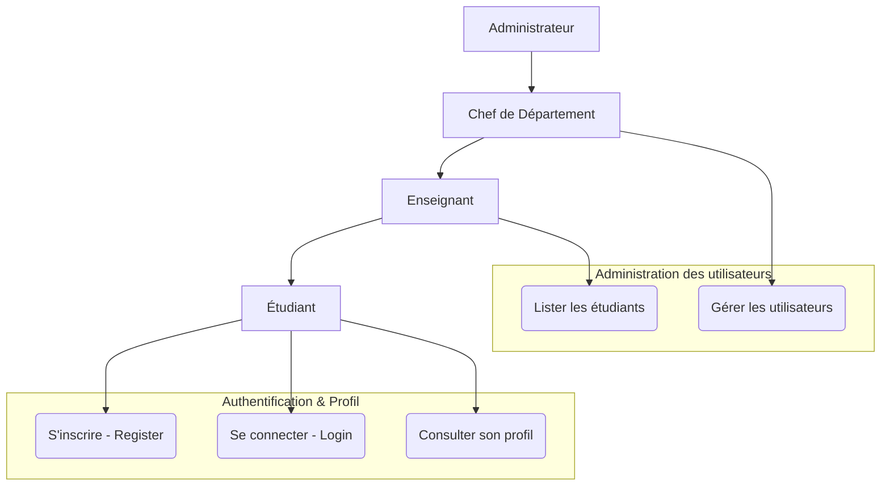

### 1.2 Diagramme de séquence (Authentification - Login)

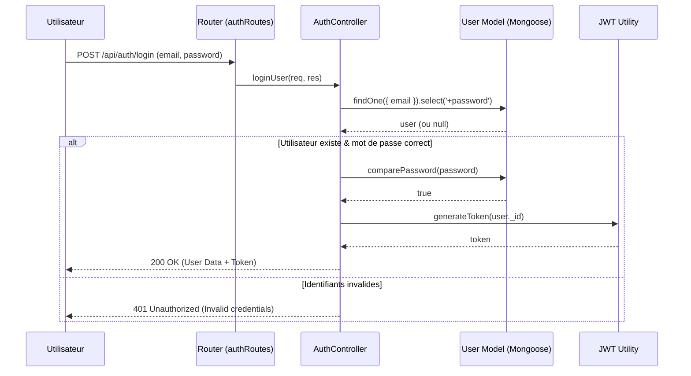

### 1.3 Diagramme de classe (Modèle User)

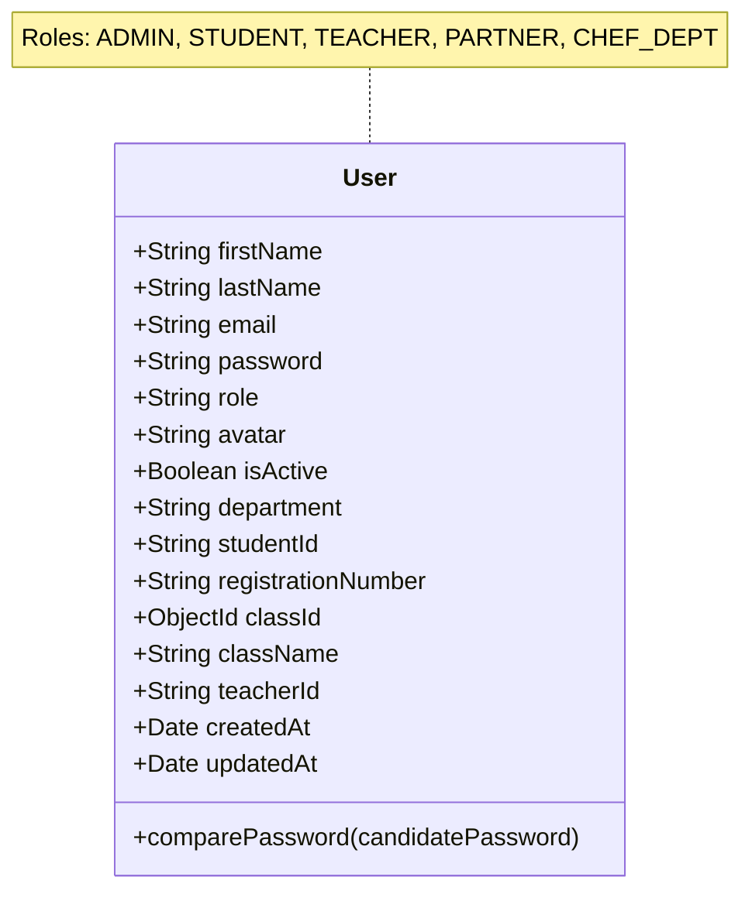

---

## Sprint 2 : Gestion des emplois du temps

### 2.1 Diagramme des cas d'utilisation

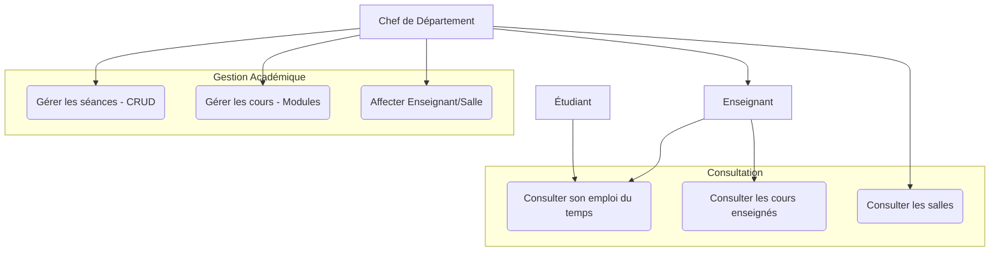

### 2.2 Diagramme de séquence (Consultation Emploi du Temps Étudiant)

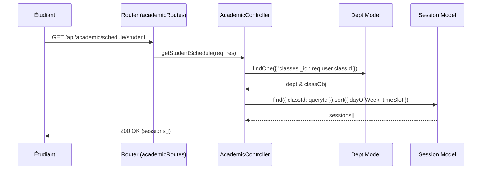

### 2.3 Diagramme de classe (Gestion Académique)

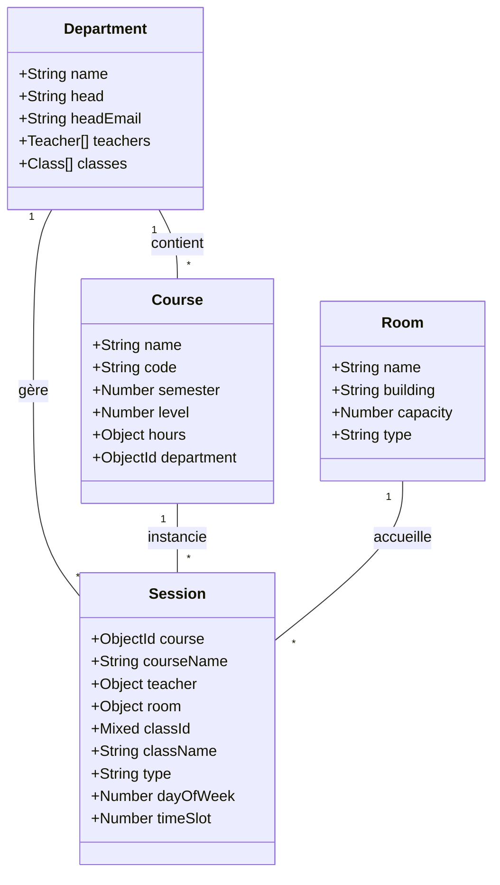

---

## Sprint 3 : Gestion des absences

### 3.1 Diagramme des cas d'utilisation

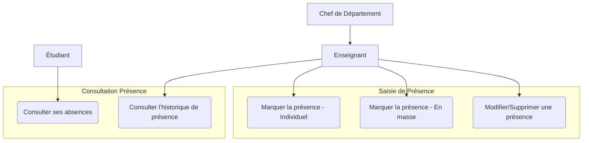

### 3.2 Diagramme de séquence (Marquage de présence en masse)

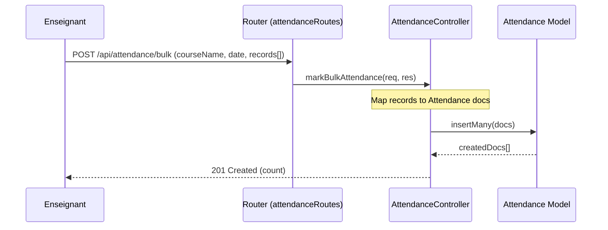

### 3.3 Diagramme de classe (Gestion des Absences)

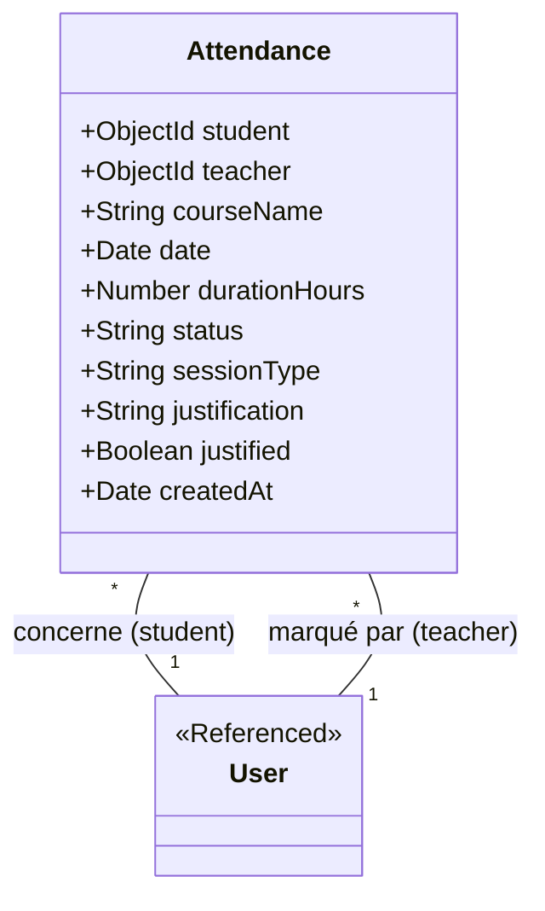

---

## Sprint 4 : Gestion des notes

### 4.1 Diagramme des cas d'utilisation

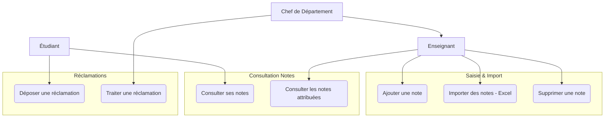

### 4.2 Diagramme de séquence (Import de notes via Excel)

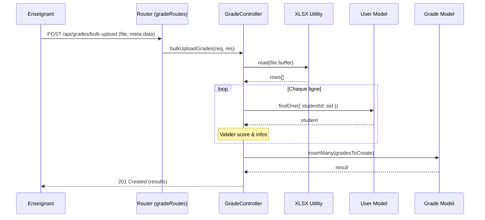

### 4.3 Diagramme de classe (Gestion des Notes & Réclamations)

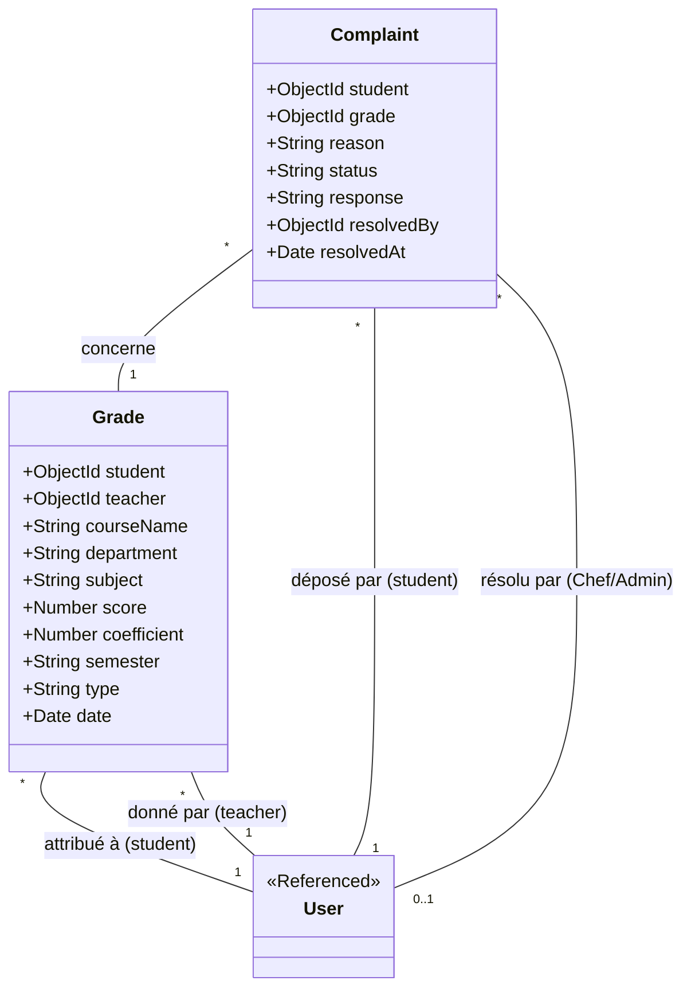

---
