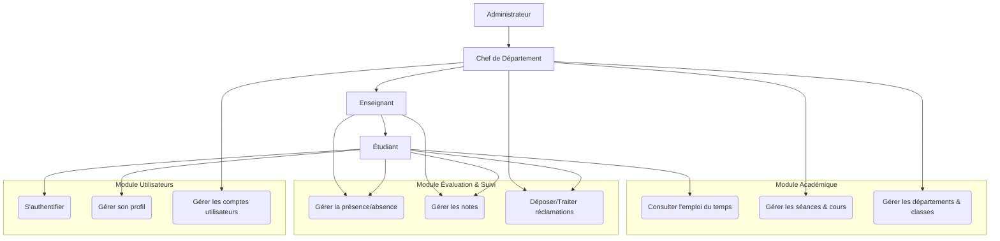
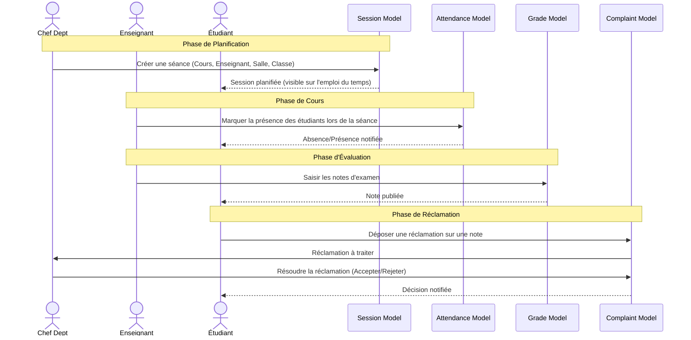
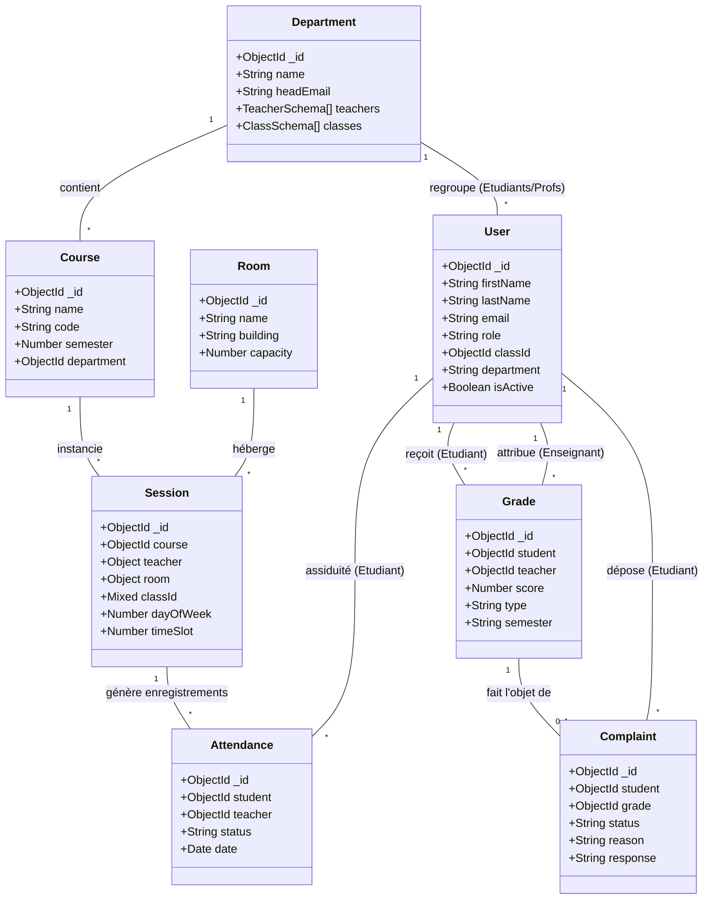

# Projet PFE : Documentation du Design Global (Mermaid UML)

Ce document présente la vision globale du système à travers des diagrammes de cas d'utilisation, de séquences et de classes couvrant l'ensemble des modules.

---

## 1. Diagramme des Cas d'Utilisation Global

---

## 2. Diagramme de Séquence Global (Cycle Pédagogique)

Ce diagramme illustre le flux principal depuis la planification d'une séance jusqu'à l'évaluation.

---

## 3. Diagramme de Classes Global

Ce diagramme présente l'ensemble des entités du système et leurs relations de dépendance.

